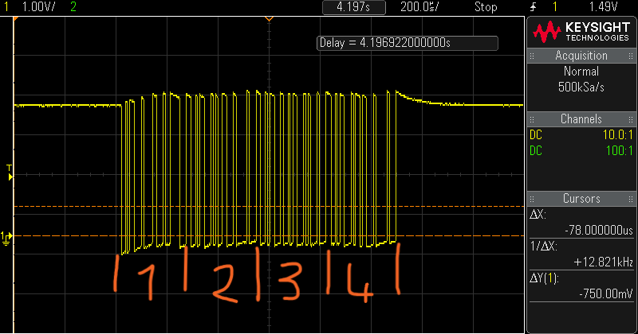

# PROJET_ELECTRONIQUE_MIDI
## Participants
* Lina Bachir
* Nicolas Haas
* Tanoh Koffi

## Code C
```C
int main (void)
{
  printf(C);
}
```

## Commandes github
Sous window: Dans le répertoire faire clique droit 'ouvrir un git bach', puis aller dans le bon dossier (si c'est pas déjà le cas):

Sous linux: Ouvrir un terminal, puis aller dans le bon dossier. Par exemple :
```
cd Documents/git_1A/PROJET_ELECTRONIQUE_MIDI/
```

Pour créer un nouveau répertoire git:
```
git config --global user.name "Pseudo git ou Nom Prénom"
git config --global user.email "Votre e-mail"
```
Testez
```
git clone adresse_du_git
```
Si git clone marche: Vous avez fini !
Sinon si git clone ne marche pas:
```
ssh-keygen
```
Faites Entrer plusieurs fois, puis copier l'adresse /c/....pub (example: /c/Users/user_name/.ssh/id_ed25519.pub)
```
cat adresse_pub_copié_ci_dessus
```
Copier ssh key, puis Ajouter ssh key sur github.com -> setting -> sshkey
```
git clone adresse_du_git
```

Pour récupérer les modifications distantes :
```
git pull
```

Pour pousser des modifications locales
```
git add .
git commit -m "Message à remplacer"
git push
```
# Rapport projet 
## Introduction

Notre projet consiste en la création d’un contrôleur MIDI, un dispositif électronique conçu pour interagir avec divers instruments et logiciels musicaux. Le contrôleur comporte une variété de boutons, de potentiomètres et de curseurs, offrant un contrôle précis et intuitif de nombreux aspects de la production musicale, tels que le volume, les effets, et la modulation.

La conception du contrôleur inclut l’intégration de plusieurs capteurs pour détecter les actions de l’utilisateur, qui sont ensuite traduites en signaux MIDI. Ces signaux sont transmis à un ordinateur ou un autre appareil musical via une interface MIDI, permettant un contrôle en temps réel de la musique.

Le développement de ce contrôleur MIDI inclut la mise en œuvre d’une carte électronique centrale, qui gère les signaux provenant des différents capteurs, ainsi qu’une interface de sortie pour la communication avec les appareils externes.

## objectif

L'objectif de notre projet est de concevoir un contrôleur MIDI fonctionnel et intuitif, permettant aux musiciens et aux producteurs de gérer et de manipuler leurs compositions musicales de manière fluide. 
Nous cherchons à créer un dispositif qui permette un contrôle précis et efficace des éléments clés de la production musicale, tels que le volume, les effets, et la modulation.

* Implémentation du MIDI classique


  Nous voulons une compatibilité universelle avec beaucoup d'instruments et de logiciels musicaux en adoptant le protocole MIDI standard. Notre contrôleur sera conçu pour envoyer et recevoir des messages MIDI de façon fiable, facilitant ainsi son intégration dans diverses configurations musicales.

* Support du MIDI USB via USB-C


  Notre objectif est d'incorporer une interface MIDI moderne utilisant un port USB-C, permettant une connexion simple et efficace avec des ordinateurs et autres appareils prenant en charge l'USB. Cela englobera la transmission de données MIDI ainsi que l'alimentation du contrôleur.

* Autonomie sur batterie rechargeable


  Nous planifions de développer un contrôleur fonctionnant sur une batterie rechargeable pour maximiser la portabilité et la flexibilité d'utilisation. La batterie sera rechargeable via USB-C, offrant ainsi aux utilisateurs la possibilité de jouer sans être dépendant d'une source d'alimentation fixe.

* Inspirations et benchmarking


  Nous nous baserons sur des modèles de référence tels que l'Intech Studio PBF4, le Faderfox MX12 pour l'ergonomie et l'AKAI MIDIMIX pour sa disposition efficace. Ces produits nous serviront de guide dans le développement de notre contrôleur.


* Cahier des charges:


* Planning des séances


* Schéma global du projet

  

## PCB 


Dans cette partie de ce rapport, nous donnerons un aperçu complet de l'architecture et des composants du PCB de ce contrôleur MIDI.
On cherchera donc ici à comprendre le rôle des composants sur ce PCB et leur disposition.
Concernant le Microcontrôleur, ici le STM 32 KBTX, il est le centre du contrôleur MIDI. Son but ici est de gérer les entrées venues des boutons et potentiomètres, de traiter ces informations et d’envoyer les messages MIDI appropriés via les interfaces MIDI ou USB.

Quant aux Régulateurs de tension, ils assurent une tension stable pour alimenter les différents composants du circuit, par exemple, fournir 5V pour le microcontrôleur et 3.3V pour certains capteurs ou circuits.

On a aussi utilisé des Condensateurs pour filtrer les signaux, déparasiter les lignes d'alimentation et stabiliser les tensions. Ils sont essentiels pour réduire le bruit électronique et maintenir la stabilité des signaux. Ils sont dispersés autour du microcontrôleur et près des régulateurs de tension, souvent à proximité des broches d'alimentation pour optimiser leur efficacité. De plus, avec les Résistances, on parviendra à Limiter le courant, ajuster les niveaux de tension et effectuer des fonctions pull-up/pull-down sur les lignes de signal, elles sont quant à elles Connectées en série avec les boutons et situées près du microcontrôleur pour les pull-ups/pull-downs.

Le Connecteur MIDI utilisé ici va servir d’interface afin de connecter le contrôleur MIDI à d'autres dispositifs MIDI. Ce connecteur permet donc la communication des données MIDI. Un autre type de connecteur utilisé est le Connecteur USB qui va Permettre la connexion du contrôleur à un ordinateur pour la transmission de données MIDI et l'alimentation.

Les Traces, Les lignes rouges et bleues sur le schéma représentent les connexions électriques entre les composants. Les rouges sont sur la couche supérieure du PCB, et les bleues sur la couche inférieure. Elles sont connectées entre les différentes couches du PCB à l’aide des Vias, qui assurent ainsi une interconnexion entre les couches du PCB. Les potentiomètres, eux, capturent les entrées de l'utilisateur. Chaque potentiomètre envoie en effet un signal spécifique au microcontrôleur.

En outre, Le microcontrôleur central gère les entrées venues des boutons et les interfaces MIDI/USB. Les régulateurs de tension, condensateurs et résistances assurent la stabilité du circuit et les connecteurs MIDI et USB permettent la communication avec d'autres dispositifs MIDI et des ordinateurs.
En résumé, lorsqu'on modifie la position d’un potentiomètre du contrôleur MIDI, le microcontrôleur détecte ce changement et identifie le potentiomètre en question. Il génère ensuite un message MIDI avec les informations appropriées (comme la note et la vélocité). Ce message est transmis soit via le connecteur MIDI DIN à d'autres appareils MIDI, soit via USB à un ordinateur.

## Résultats
Nous avons réussi à faire fonctionner la carte, et a lui faire envoyer, via l'USART, des trames MIDI correspondants aux valeurs des potentiomètres.

Voici les valeurs que renvoient un des potentiomètres linéaire et un des potentiomètres rond. C'est valeurs doivent être comprise entre 0 et 127, car en MIDI on la code sur 7 bits.
Sel est le numéro transmis aux 4 MUX analogiques.


La carte regarde en boucle la valeur des potentiomètres. Si la valeur change, alors une trame MIDI est envoyée.

Comme l'ADC fait 4 conversions à la fois, nous pouvons voir 4 trames MIDI qui ce suivent:


Chaque trame comporte 3 octets, ayant chacun leur bit de start à 0.
* Le 1er octet et l'identifiant ici 0x1A
* Le 2e est le numéro du potentiomètre ici 24
* Le 3e et dernier est la valeur du potentiomètre (ici 30) codée sur 7 bits (donc le MSB qui se situe à droite est toujours à 0)


On remarque que les curseurs sont espacés de 9 bits et d'une durée de 78us. Ce qui est en accord avec notre programme que nous avons configuré pour émettre à une vitesse de 115200 bauds.

## Code


## Les difficultés rencontrées

* Lors de schéma afain d'avoir les bonnes valeurs des résistances et condensateurs.
* Le routage nous a aussi appris qu'il faut mettre des composants de protections, ainsi que le BMS pour la recharge de la batterie.
* Dans le routage, qui nous ont permis d'apprendre les bonnes pratiques.
* L'USART du STM32 ne voulait pas fonctionner en Half-Duplex, on a donc dû le mettre en Asynchronous. Nous avons donc la broche TX qui ne sert à rien.
* Pour le soudage de composants CMS, car il faut être précis.
